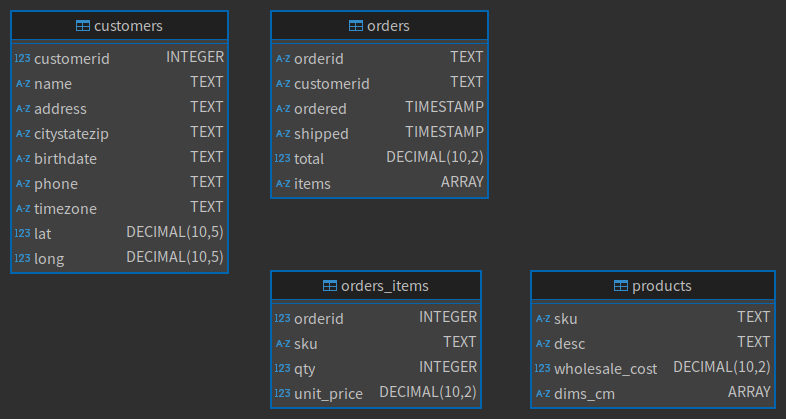

# Hanukkah of Data

[🕎 Hanukkah of Data](https://hanukkah.bluebird.sh/5784/) is solved using [SQLite](https://www.sqlite.org/).

| Day |                           Name                           |
|-----|----------------------------------------------------------|
| 🕯️  | [The Investigator](./hanukkah-of-data/Scripts/day01.sql) |
| 🕯️  | [The Neighbor](./hanukkah-of-data/Scripts/day02.sql)     |
|     |                                                          |

## Thankyou

+ [sqlean](https://github.com/nalgeon/sqlean)

## License

MIT License.

Copyright (c) 2024 Manuel Alejandro Gómez Nicasio <az-dev@outlook.com>

See [LICENSE.md](LICENSE.md) for details.
